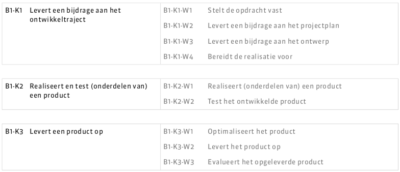

## WriterStatus
http://25682.hosts2.ma-cloud.nl/bewijzenmap/periode1.4/proj/myband/public/ is een website van (Diaquino Fortmeier) waar gebruikers (wattpad nieuws kunnen lezen en bekijken wanneer evenementen worden gehouden, maar ook hun favoriete schrijvers kunnen opzoeken en zien welke boeken hun al hebben geschreven) bedoeld voor (schrijvers/lezers)
De website is enigszins te vergelijken met (wattpad.com) of (fanfiction.net) maar toch anders omdat (hier alleen wordt gefocused op de het laatste nieuws en updates, maar ook de status te weergeven van schrijvers)

### Uniek aan dit concept is: 
 * eerste u.s.p. (De laatste updates of evenementen worden hier weergegeven)
 * tweede u.s.p. (Je kan de status van je favoriete schrijver bijhouden of nieuwe schrijvers ontdekken)

---
#### Milestones 

In het [Kwalificatiedossier] voor de opleiding Mediadeveloper staan een aantal *kerntaken* en *werkprocessen*.
In onderstaande tabel zie je per kerntaak en werkproces welke werkzaamheden en documenten hier bij horen.
Elke opgeleverd product of document is een *milestone*, een belangrijke stap die nodig is bij de ontwikkeling van jouw MyBand project.

Je wordt beoordeeld op de aanwezigheid en inhoud van onderstaande documenten.

##### Fase 1: Opdracht vaststellen / Projectplan en planning / Ontwerpen & voorbereiden 

Deze fase duurt 3 weken

| Milestone  | Status | Link | Type Document of cloudservice |
| ------ |  ------ | ------ | ------ |
| README                                            | DONE | [README.md]  (dit document)          | Markdown |
| B1-K1-W1 Debriefing                               | DONE | [Debriefing]                         | Markdown |
| B1-K1-W2 Planning                                 | DONE | [Planning]                           | Markdown |
| B1-K1-W2 Plan van aanpak                          | DONE | [Plan van Aanpak]                    | Markdown of Word/RTF|
| B1-K1-W2 User stories                             | DONE | [User Stories]                       | Markdown of Word/RTF|
| B1-K1-W2 Functioneel ontwerp                      | DONE | [FO]                                 | Markdown of Word/RTF|
| B1-K1-W2 Flowchart                                | DONE | [Flow]                               | Afbeelding(en) of geexporteerd uit http://draw.io |
| B1-K1-W2 Urenschatting                            | DONE | [Urenschatting]                      | Markdown |
| B1-K1-W2 Wireframes en/of Interactief prototype   | DONE | [axShare]                            | Axshare link of link naar ander online prototype tool |
| B1-K1-W2 Sfeer impressie / schermontwerpen        | TODO | [Design]                             | Afbeeldingen |

[Kwalificatiedossier]: https://kwalificaties.s-bb.nl/Handlers/DocumentLibrary.ashx?id=276758
[README.md]: <https://github.com/imcrazydia/myband/blob/master/README.md>
[Debriefing]: <https://github.com/imcrazydia/myband/blob/master/none_code/debriefing.md>
[Planning]: <doc/fase-1/planning.md>
[Plan van Aanpak]: <doc/fase-1/plan-van-aanpak.md>
[User stories]: <https://github.com/imcrazydia/myband/blob/master/none_code/backlog_sprints.pdf>
[Design]: <doc/fase-1/design/design.md/>
[FO]: <https://github.com/imcrazydia/myband/blob/master/none_code/functioneelontwerp.pdf>
[Flow]: <https://github.com/imcrazydia/myband/blob/master/none_code/functioneelontwerp.pdf>
[Urenschatting]: <https://github.com/imcrazydia/myband/blob/master/none_code/backlog_sprints.pdf>
[axShare]: <http://w2d1bw.axshare.com/>

#### Fase 2: Realiseren van de opdracht (in sprints)

| Milestone  | Status | Link |
| ------ |  ------ | ------ |
| B1-K1-W2 Product backlog                          | DONE | [Backlog]                            | Link naar Trello met Sprint planningen | |
| B1-K1-W2 Sprint planning 1, 2 en 3                | DONE | [Trello] / [Trello Tips]             | Link naar Trello met Sprint planningen | |
| B1-K1-W3 Technisch Ontwerp                        | TODO | [TO]                                 | Markdown of Word/RTF| |

[Backlog]: <https://github.com/imcrazydia/myband/blob/master/none_code/backlog_sprints.pdf>
[TO]: </doc/fase-2/technisch-ontwerp.md>
[Trello]: https://trello.com/b/k08G5m4f/myband
[Trello Tips]: <https://blog.trello.com/how-to-scrum-and-trello-for-teams-at-work>
   
#### Fase 3: Testen en opleveren van het project

| Milestone  | Status | Link |
| ------ |  ------ | ------ |
| B1-K3-W2 Link naar de live omgeving                        |  DONE |  <http://25682.hosts2.ma-cloud.nl/bewijzenmap/periode1.4/proj/myband/public/> |
| B1-K3-W2 Gebruikersdocumentatie / instructie               |  TODO |  [Gebruikers documentatie] |
| B1-K3-W3 Evaluatie                                         |  TODO |  [Evaluatie] |

[Gebruikers documentatie]: <doc/fase-3/gebruikersdocumentatie.md>
[Evaluatie]: <doc/fase-3/evaluatie.md>
